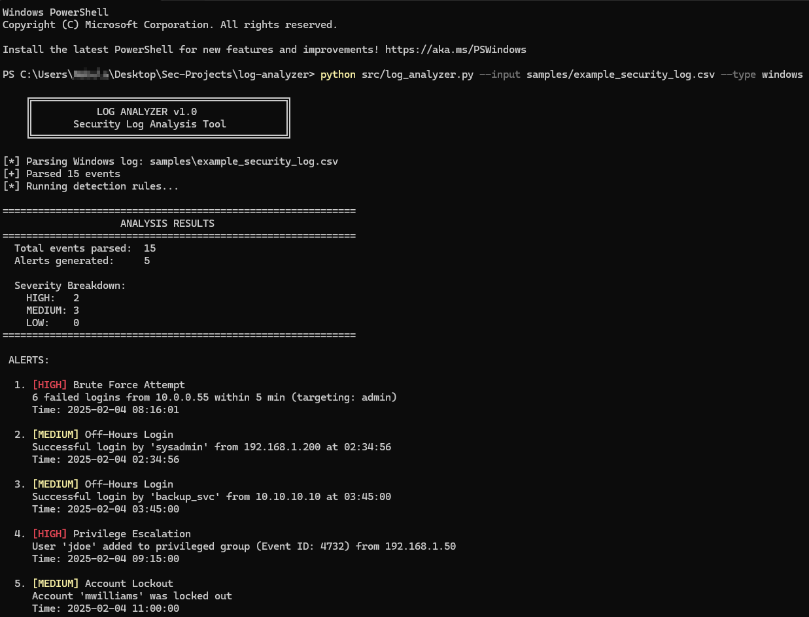

# Log Analyzer

A Python-based security log analysis tool designed for SOC analysts. Parses log files, detects suspicious activity, and generates actionable reports.

## Features

- **Log Parsing**: Supports Windows Security Event Logs (.evtx, .csv) and Linux auth logs
- **Threat Detection**: Identifies suspicious patterns including:
  - Failed login attempts (brute force detection)
  - Logins at unusual hours
  - Privilege escalation events
  - Account lockouts
- **Reporting**: Generates clean, readable reports with severity ratings


## Demo

### Analysis Output



  

## Installation

```bash
git clone https://github.com/YOUR_USERNAME/log-analyzer.git
cd log-analyzer
pip install -r requirements.txt
```

## Usage

```bash
# Analyze a Windows Security Event Log (CSV export)
python src/log_analyzer.py --input samples/security_log.csv --type windows

# Analyze a Linux auth log
python src/log_analyzer.py --input /var/log/auth.log --type linux

# Generate HTML report
python src/log_analyzer.py --input samples/security_log.csv --type windows --report html
```

## Project Structure

```
log-analyzer/
├── src/
│   ├── log_analyzer.py      # Main script
│   ├── parsers/             # Log parsing modules
│   ├── detectors/           # Detection rule modules
│   └── reporters/           # Report generation
├── samples/                 # Sample log files for testing
├── output/                  # Generated reports
├── tests/                   # Unit tests
├── config.yaml              # Configuration file
├── requirements.txt
└── README.md
```

## Detection Rules

| Rule | Description | Severity |
|------|-------------|----------|
| Brute Force | 5+ failed logins within 5 minutes from same source | High |
| Off-Hours Login | Successful login between 12am-5am | Medium |
| Privilege Escalation | User added to admin/privileged group | High |
| Account Lockout | Account lockout event detected | Medium |

## Roadmap

- [x] Project setup
- [ ] Windows Event Log parser (CSV)
- [ ] Basic detection rules
- [ ] Terminal output
- [ ] HTML report generation
- [ ] Linux auth.log parser
- [ ] IP reputation lookup (VirusTotal/AbuseIPDB)
- [ ] Custom detection rules via config

## Author

**RootlessGhost**

Junior Penetration Tester | SOC Analyst in Training

## License

MIT License - See [LICENSE](LICENSE) for details
